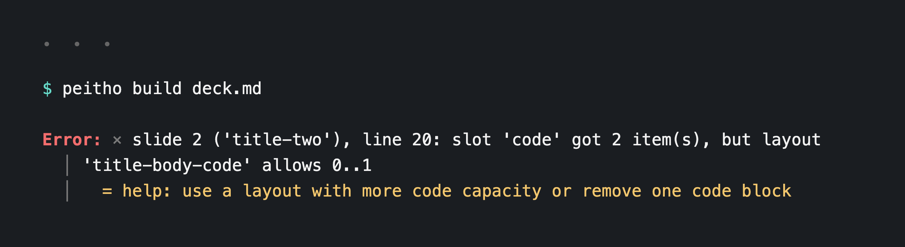
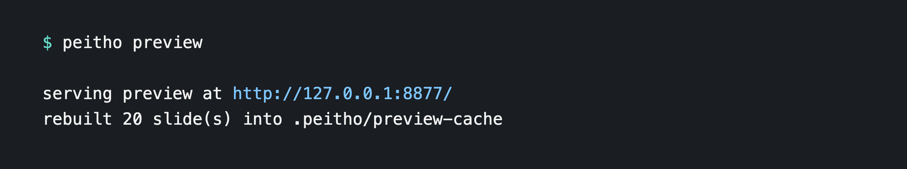
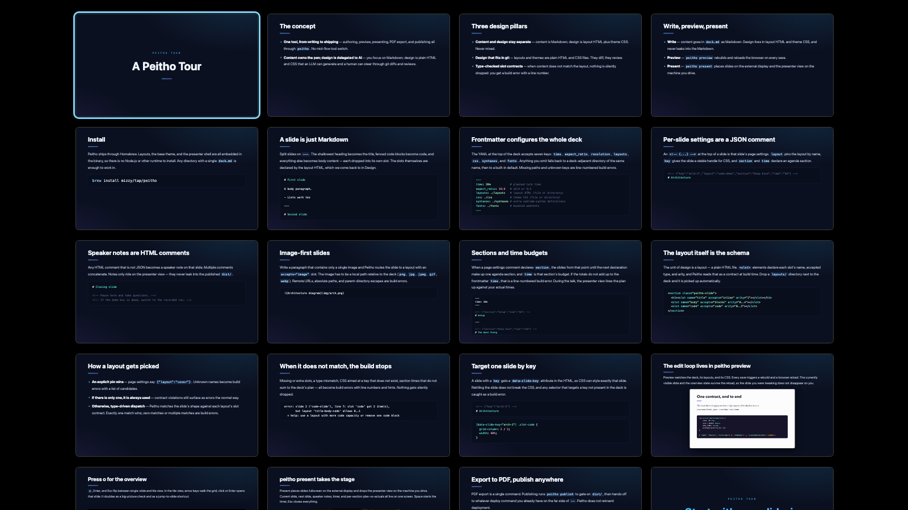
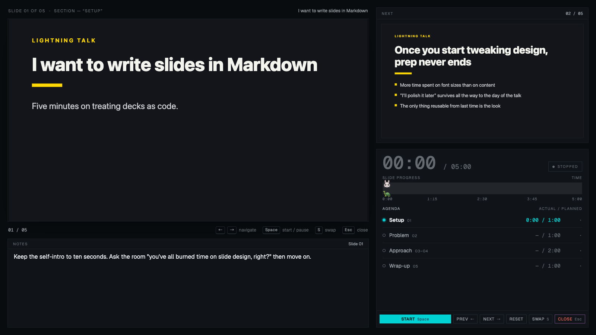
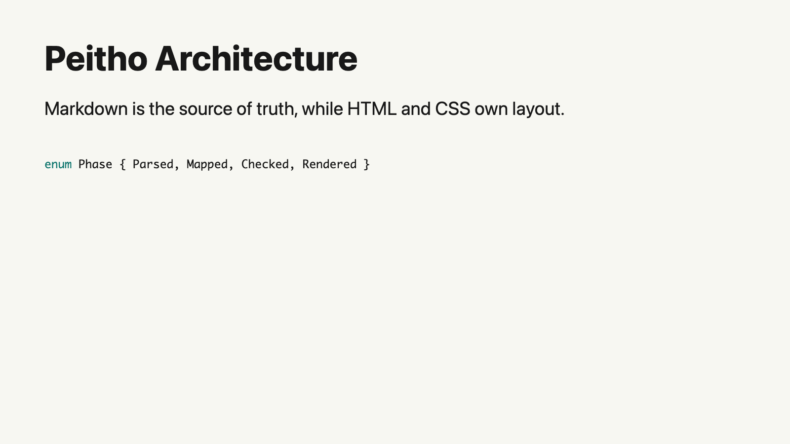
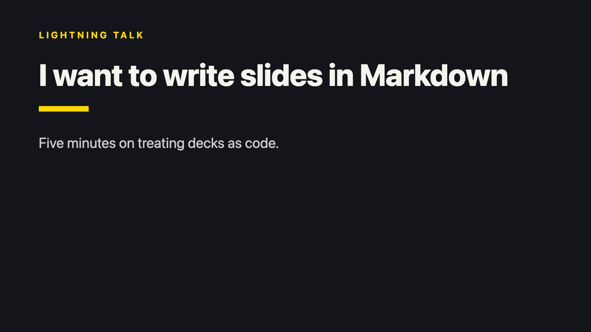
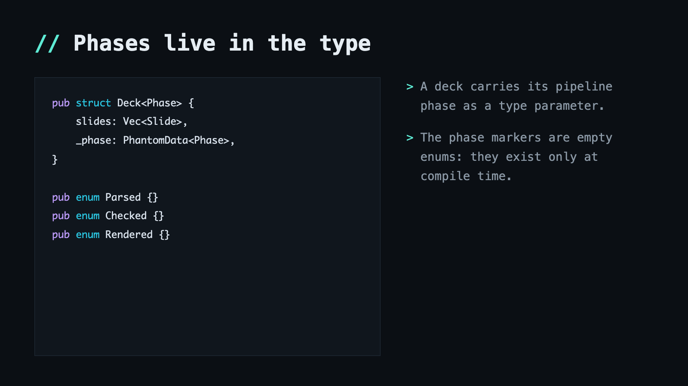
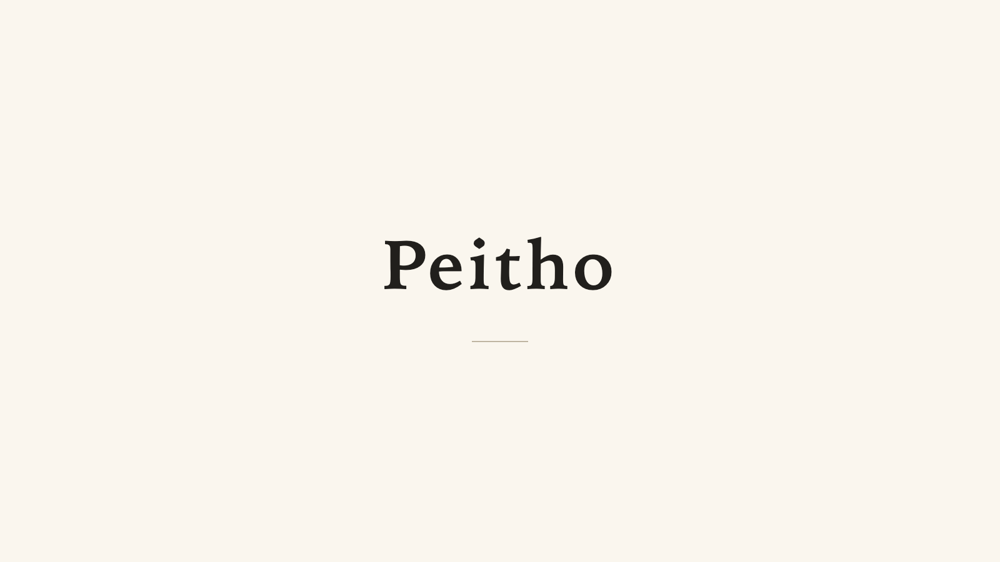
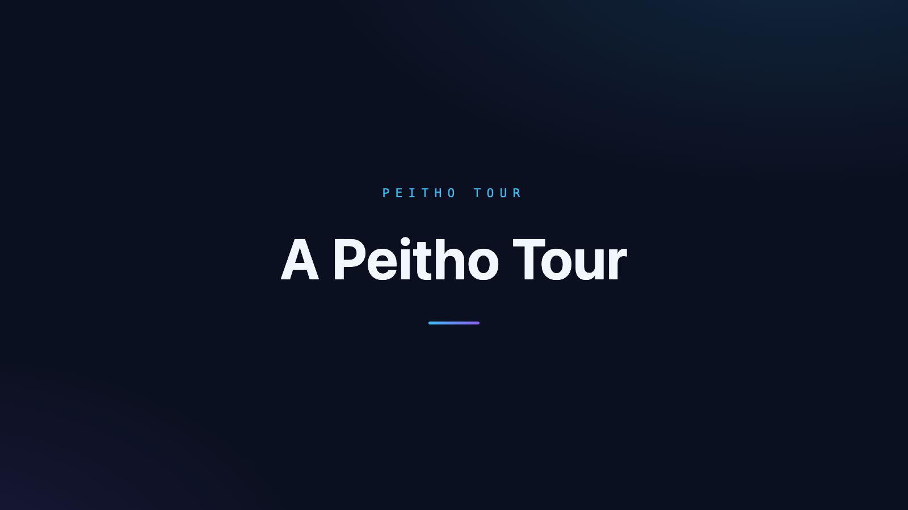
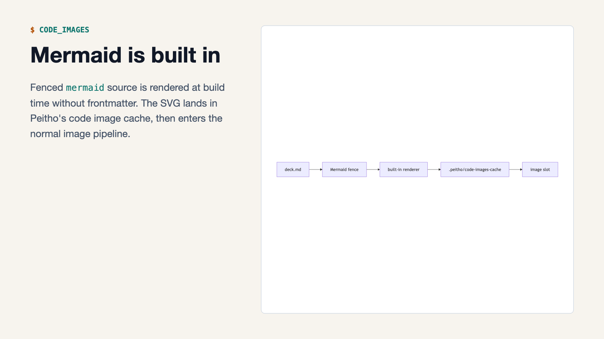

# peitho

An HTML-native presentation tool that treats Markdown as the source of truth.

Peitho is the Greek goddess who presides over the power to move people's hearts with words rather than force — a fitting match for the essence of presentation.

Docs & demos: **[peitho.gosu.ke](https://peitho.gosu.ke/)** — a guide, an examples gallery, and the example decks built and served under `/demo/<name>/`. Auto-deployed on push to `main`; `envchain peitho make deploy-demo` for manual deploys.

## How it works

Content is Markdown. Design is layout HTML plus theme CSS, versioned in git right next to the content. The two never mix — and the layout itself is the schema: each `<slot>` declares what it accepts and how many, and peitho type-checks every slide against its layout at build time. This is the built-in default layout, in its entirety:

```html
<section class="peitho-slide">
  <h1><slot name="title" accepts="inline" arity="1"></slot></h1>
  <div class="body">
    <slot name="body" accepts="blocks" arity="0..*"></slot>
  </div>
  <figure class="code">
    <slot name="code" accepts="code" arity="0..1"></slot>
  </figure>
</section>
```

Content that doesn't fit the contract — missing or extra slots, type mismatches, dangling references, leftover content — stops the build with a line number and a hint. Nothing is ever silently dropped:



The three pillars, in short:

- **Separation of content and design** — content is Markdown, design is layout HTML and CSS. While writing, you never think about design; the design carries over to your next deck
- **Git-manageable layouts** — design artifacts are plain HTML/CSS. They diff and review cleanly
- **Type-checked slot contracts** — the layout is the schema. Violations are build errors with line numbers and hints, never silent drops

## Quick start

```sh
brew install mizzy/tap/peitho    # prebuilt binaries and cargo: see Install below
```

Write `deck.md` (or scaffold one with `peitho new my-deck`). Convention mapping turns plain Markdown into slides as-is: slides are separated by `---`, the shallowest heading is the title, code blocks go to the code slot, and the rest becomes the body. Deck-level settings live in YAML frontmatter, per-slide settings in a `<!-- { ... } -->` JSON comment, and non-JSON HTML comments become speaker notes:

````markdown
---
time: 15m
---

<!-- {"key":"intro","section":"Setup","time":"3m"} -->
# Title

A body paragraph.

<!-- Speaker note: introduce yourself, then move fast. -->

- Lists work
- too

---

<!-- {"section":"Deep dive","time":"12m"} -->
# Next slide

```rust
enum Phase { Parsed, Mapped, Checked, Rendered }
```
````

### Preview while you write

`peitho preview` watches the deck and its assets, rebuilds on every save, and reloads the browser — keeping the slide you were on and the overview mode across reloads:



Press `o`, `Enter`, or `Esc` to flip between the single-slide view and a tile overview of the whole deck; arrows walk the grid, and clicking (or `Enter`) opens the selected tile:



### Present

`peitho present` puts the slides full-screen on an external display and automatically places a presenter view — current and next slide, speaker notes, and a timer with a per-section agenda — on your machine:



`Space` starts/pauses the timer, arrows navigate, `S` swaps the two windows if the displays were misidentified, and `Esc` closes everything. For debugging (or a single display), `--presenter-windowed` opens normal windows instead of full screen.

To use a phone as a persistent remote, run `peitho present --host`. Peitho picks the best non-loopback address on your machine (a VPN address such as Tailscale is preferred), pins the port to `6173` so the URL stays the same across runs, and prints a terminal QR code alongside it. Scan the QR once in Safari, use the share sheet's Add to Home Screen action, and the remote opens full-screen without the Safari address bar — landscape or portrait, with iOS safe-area insets already accounted for — every subsequent `peitho present --host`. Pass `--host <IP>` (or `--host 0.0.0.0`) to bind a specific address, and `--port` to override the default when 6173 is taken.

### Ship it

```sh
peitho export pdf -o deck.pdf                     # print-quality PDF
peitho publish -- aws s3 sync dist/ s3://bucket/  # inspect dist/, then hand off to your deploy command
```

`publish` gatekeeps `dist/` — the presentation shell and speaker notes are never mixed into distributed artifacts — and then delegates to whatever deploy command follows `--`. Don't reinvent the deploy.

## Writing decks

### Per-slide settings

A slide's page settings are one `<!-- { ... } -->` JSON comment (at most one per slide):

- `key` — a stable handle for per-slide CSS. Edit the title and the CSS still holds; target a key that doesn't exist and the build stops:

  ```css
  [data-slide-key="arch-1"] .slot-code {
    grid-column: 2 / 3;
    width: 60%;
  }
  ```

- `layout` — pin a layout by name, e.g. `{"layout":"cover"}`. An unknown name is a build error with a candidate list
- `section` + `time` — the marked slide starts an agenda section that runs until the next marker. Section budgets must add up to the deck's `time` frontmatter (when present) — mismatches are build errors with line numbers. During the talk, the presenter agenda shows planned vs. actual per section in real time

### Speaker notes

Any non-JSON HTML comment in a slide body becomes that slide's speaker note (Marp / [k1LoW/deck](https://github.com/k1LoW/deck)-style); multiple comments are joined with a blank line. Notes ride only into the presenter view — `dist/` never contains them (the publish contamination check enforces this).

### Images

Markdown images are local files written as an image-only paragraph:

```markdown

```

Image paths are deck-relative and must use supported local image extensions (`png`, `jpg`, `jpeg`, `gif`, `webp`). Remote URLs, absolute paths, parent-directory escapes, query strings, fragments, and backslash separators are build errors. A slide with an image must map to a layout with exactly one unambiguous `accepts="image"` slot; style the rendered `` through normal layout CSS, for example `.slot-hero img { max-width: 100%; }`.

### Explicit slots

When convention mapping can't tell where content belongs — two-column layouts, multiple `blocks` slots — route it explicitly with `::: {slot=name}` fenced blocks:

```markdown
# Two columns

::: {slot=left}
Everything here goes to the `left` slot.
:::

::: {slot=right}
And this to `right`.
:::
```

Unclosed or nested blocks, unknown slot names, and contract violations inside the routed content are all build errors with line numbers.

### Diagrams as code

Fenced `mermaid` blocks render to SVG at build time with Peitho's built-in Mermaid renderer. The generated SVG is cached and then routed as a normal image, so the slide still needs a layout with an `accepts="image"` slot.

Use `code_images:` for other diagram tags, or to override the built-in Mermaid renderer with an external command. Peitho pipes the fence source to the declared command, expects SVG on stdout, caches the result, and then routes it as a normal image:

```yaml
code_images:
  dot: dot -Tsvg
  mermaid: mmdc -i - -o - -e svg  # optional override
```

See the [frontmatter guide](https://peitho.gosu.ke/guide/frontmatter/#code-images) and the [Code Images example](https://peitho.gosu.ke/examples/code-images/) for built-in Mermaid behavior and a Mermaid/Graphviz deck.

### Deck frontmatter

All deck-intrinsic settings live in YAML frontmatter at the top of the deck. Supported keys:

| Key | Purpose | Value |
|---|---|---|
| `time` | Planned presentation time | `15m` / `90s` / `1h30m` / bare integer (minutes) |
| `aspect_ratio` | Slide canvas aspect ratio | `16:9` (default) / `4:3` |
| `resolution` | PDF-only physical page size | `WxH` CSS px, e.g. `1920x1080` (must match `aspect_ratio`) |
| `breaks` | Render single newlines in slide body Markdown as hard line breaks | `true` / `false` (default) |
| `layouts` | Layout HTML file or directory | Deck-relative path, e.g. `./layouts` |
| `css` | Theme CSS file or directory | Deck-relative path, e.g. `./css` |
| `syntaxes` | Custom syntect syntaxes | Deck-relative path, e.g. `./syntaxes` |
| `fonts` | Font files copied into the output | Deck-relative path, e.g. `./fonts` |
| `code_images` | External renderer overrides for fenced-code-to-SVG conversion | Mapping of `tag: command-string` (nested; Mermaid is built in unless overridden) |

Absent asset keys fall back to a deck-adjacent directory of the same name (zero-config), then to the binary's built-in default (fonts simply add nothing when absent). A key that points at a non-existent path is a build error with the frontmatter line number. Asset values may be a file or a directory: `layouts`/`css`/`syntaxes` read `*.html` / `*.css` / `*.sublime-syntax` in filename order, while `fonts` copies files verbatim without an extension filter, so `.woff2`, `.ttf`, and `@font-face` CSS files can sit side by side.

## Layouts and themes

Point `layouts:` in the deck's frontmatter at an HTML file or a directory of `*.html` files; a directory turns every `*.html` inside it into a layout (name is the file stem, order is deterministic by filename). Zero-config: a `layouts/` directory next to the deck is picked up automatically. Each slide's layout is chosen in the following order (a hybrid approach inspired by the page settings in [k1LoW/deck](https://github.com/k1LoW/deck)):

1. **Explicit** — if a page-settings comment `<!-- {"layout":"cover"} -->` is present, use that layout (an unknown name is a build error with a candidate list)
2. **Single layout, unconditional** — if there is only one layout, always use it (contract violations still error with line numbers, as usual)
3. **Type-driven dispatch** — with multiple layouts, each slide is routed to the layout whose slot contract matches the shape of its content (title only / has body / has code, etc.). Exactly one match is required; **multiple matches (ambiguous) and zero matches are both build errors** rather than silently resolved, prompting an explicit choice

### Syntax highlighting

Code blocks with a language tag are turned into `hl-*` class spans by [syntect](https://github.com/trishume/syntect) at build time. There is no runtime JS; colors are defined in theme CSS. An unknown language tag is a build error with a line number (no tag means plain rendering).

To add languages, point `syntaxes:` in the frontmatter at a `.sublime-syntax` file or a directory of `*.sublime-syntax` files, or drop a `syntaxes/` directory next to the deck. Both augment the built-in set, so built-in tags like `rust` and `js` still work.

## Install

### Homebrew (macOS / Linux)

```sh
brew install mizzy/tap/peitho
```

Shell completions for bash/zsh/fish are installed automatically.

### Prebuilt binaries

Grab a prebuilt binary from the [Releases page](https://github.com/mizzy/peitho/releases). Each release ships a tarball per target with a single `peitho` binary — everything (layouts, base theme, presentation shell) is embedded, so Node.js and npm are not needed at runtime.

```sh
# macOS arm64 (Apple Silicon) — replace vX.Y.Z with the version you want
curl -LO https://github.com/mizzy/peitho/releases/download/vX.Y.Z/peitho-vX.Y.Z-aarch64-apple-darwin.tar.gz
curl -LO https://github.com/mizzy/peitho/releases/download/vX.Y.Z/peitho-vX.Y.Z-aarch64-apple-darwin.tar.gz.sha256
shasum -a 256 -c peitho-vX.Y.Z-aarch64-apple-darwin.tar.gz.sha256
tar xzf peitho-vX.Y.Z-aarch64-apple-darwin.tar.gz
mv peitho-vX.Y.Z-aarch64-apple-darwin/peitho /usr/local/bin/
```

Available targets: `aarch64-apple-darwin`, `x86_64-unknown-linux-gnu`, `aarch64-unknown-linux-gnu` (Intel Mac is currently not supported because the GitHub Actions macos-13 runner queue wait times are too long). Or build from source with `cargo install --path crates/peitho` after cloning (run `cd packages/peitho-present && npm ci && npm run build` first so the shell is up to date).

## CLI reference

The deck argument defaults to `deck.md` in the current directory, so it can be omitted when the file follows the convention.

```sh
# Scaffold a starter deck (deck.md + layouts/ + css/base.css + .gitignore; --layouts default|split|cover, --theme light|dark)
peitho new my-deck

# Generate the distribution (dist/ with slides/ fragments + manifest.json + index.html + peitho.css)
peitho build            # same as: peitho build deck.md

# Inspect layout slot contracts and explain dispatch for a slide key
peitho layouts --explain intro

# Diagnose the runtime environment (Chrome, displays, embedded shells, deck assets)
peitho doctor

# Check rendered slides for content that overflows the slide box
peitho lint

# Daily editing loop: watch, serve, open, and reload on every successful rebuild
peitho preview

# Rebuild on every save for an external server or pipeline
peitho build --watch

# Present (generates a volatile cache + local server + launches the browser. Auto-places across two displays)
peitho present

# Present with a phone remote (LAN-reachable /remote URL + terminal QR code + fixed :6173 port for Add to Home Screen)
peitho present --host

# Debug: open in a normal window instead of full-screen (Chrome restores the previous position/size. On a single display the slides open in a window too)
peitho present --presenter-windowed

# Export a PDF
peitho export pdf -o deck.pdf

# A deck with a non-default name is passed explicitly
peitho build slides.md

# Publish (inspects, then delegates to your existing deploy command. Don't reinvent the deploy)
peitho publish -- aws s3 sync dist/ s3://your-bucket/

# Generate a shell completion script (bash / zsh / fish / powershell / elvish)
peitho completions zsh
```

`peitho lint` renders each slide in headless Chrome and warns when layout
content exceeds the slide box by more than 1px on either axis. It exits 1
when any overflow warning is found and 0 when the deck is clean; it uses the
same Chrome discovery as `peitho export pdf`.

Layouts, themes, and the presentation shell use defaults embedded in the binary, so a single deck file works in any directory. Point at your own assets from the deck's frontmatter (`layouts:`, `css:`, `syntaxes:`, `fonts:`) or drop `layouts/`, `css/`, `syntaxes/`, and `fonts/` next to the deck for zero-config pickup. Only `--shell` remains as a CLI-side dev/debug swap for the presentation shell bundle itself.

## Examples

`examples/` holds samples that differ entirely in content, layout structure, and theme. Each directory is self-contained: `deck.md`, plus `layouts/` and `css/` when the deck brings its own design. All of them except the `pdf-export` fixture and `draft-skip` (whose behavior is only observable locally) are built and browsable on the [examples gallery](https://peitho.gosu.ke/examples/).

| Sample | Content | Design | Contract highlight |
|---|---|---|---|
| `examples/minimal/` | Minimal demo | Default theme | Works as-is with built-in defaults |
| `examples/lightning-talk/` | Five-minute LT on decks-as-code | Dark, poster-style with large type | No code slot — writing code is a build error |
| `examples/code-walkthrough/` | Rust typestate walkthrough | Terminal-style two-column | `code` has `arity="1"` — every slide requires code. A practical keyed-override example |
| `examples/keynote/` | Product keynote | Cream background, serif, centered | Two-layout setup. Title-only slides go to `cover`, slides with a body go to `statement` via type-driven dispatch |
| `examples/peitho-tour/` | Peitho's own product tour | Dark space theme with cyan/purple accents | Four layouts (`cover`, `topic`, `code`, `shot`), a full six-section agenda, an image slide that lands on the `shot` layout by type-driven dispatch, and multi-comment speaker notes throughout |
| `examples/two-column/` | Explicit slot syntax demo | Two-column layout | `::: {slot=left}` / `::: {slot=right}` route content where convention mapping can't decide between two `accepts="blocks"` slots |
| `examples/layout-pin/` | Explicit layout pin demo | Two looks: light `statement`, dark `spotlight` | Both layouts declare the same slot contract, so structural dispatch can never decide — every slide carries a `{"layout":"…"}` pin |
| `examples/image-showcase/` | Markdown image slide | Framed visual layout | `accepts="image"` receives `` and CSS styles `.image-showcase img` |
| `examples/code-images/` | Diagram-as-code: fenced mermaid / dot blocks become SVG images at build time | Two-tone: dark source panel next to light rendered pane | Mermaid uses the built-in renderer; `code_images:` declares the Graphviz command and any explicit overrides |
| `examples/custom-syntax/` | Custom highlight grammar demo | Default theme | A deck-adjacent `syntaxes/toml.sublime-syntax` turns an unknown-language build error into build-time TOML highlighting |
| `examples/custom-fonts/` | Bundled webfonts demo | Playfair Display + JetBrains Mono, all local `.woff2` | Zero-config `fonts/` auto-detect; files (including licenses) are copied verbatim into every output |
| `examples/aspect-ratio-4-3/` | 4:3 canvas demo | Default theme | `aspect_ratio: 4:3` frontmatter switches the slide canvas to 960x720 |
| `examples/draft-skip/` | Per-slide `draft` / `skip` flags | Default theme | A draft slide is dropped at parse end and appears in no output; a skipped slide stays in output but present/preview `next`/`prev` step over it |
| `examples/pdf-export/` | PDF export fixture | Default theme | `aspect_ratio` + `resolution` frontmatter set the PDF page size; speaker notes stay out of the exported PDF |

Same tool, same Markdown conventions — entirely different decks:

| | |
|---|---|
|  |  |
|  |  |

The Peitho tour turns the tool on itself — one deck walking through the concept, three pillars, and the write/preview/present loop across four custom layouts, type-driven dispatch, agenda sections, and speaker notes:



Diagrams as code: the code-images deck's fenced `mermaid` block, rendered to an SVG image at build time by the built-in renderer:



```sh
# Each sample has its layouts/ and css/ alongside it, so no flags are needed by convention
peitho present examples/keynote/deck.md
```

The Makefile targets are handy for smoke-testing (`make help` for a list; `make keynote`, `make lightning-talk`, etc. They `cargo run` including the shell-bundle build).

## Architecture

```
Markdown ─→ peitho build (parse, map, 4-stage check. Deterministic, pure functions)
              ├─ emit distribute → dist/ (distribution only; no shell or notes mixed in)
              ├─ emit preview    → .peitho/preview-cache/ (preview shell; volatile)
              └─ emit present    → .peitho/present-cache/ (presentation shell; volatile)
```

- The build core is Rust (typestate: `Parsed→Mapped→Checked→Rendered`. Unchecked slides can't reach the renderer)
- The presentation shell is TypeScript. The contract (domain types like the manifest) has Rust as its single source; TS types are generated into `bindings/` and CI checks for drift
- When developing the presentation shell, rebuild `dist/shell.js` and `dist/preview.js` with `cd packages/peitho-present && npm ci && npm run build` (both are committed; CI checks for drift)
- See `docs/PEITHO_KICKOFF.md` for the detailed design

## License

MIT
