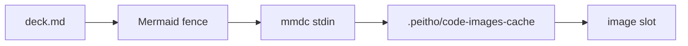
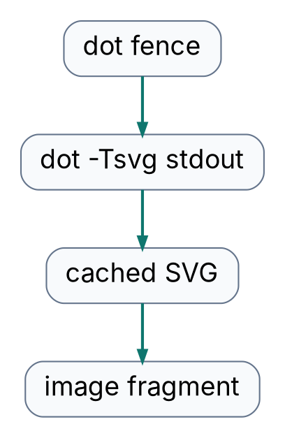
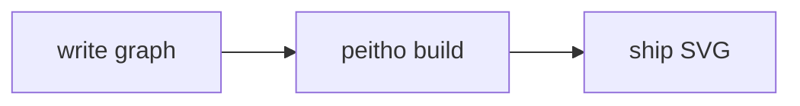

<!-- {"key":"mermaid-flow"} -->
# Mermaid becomes a build artifact

Fenced `mermaid` source is sent to `mmdc` at build time. The SVG lands in
Peitho's code image cache, then enters the normal image pipeline.



---
<!-- {"key":"graphviz-flow"} -->
# Graphviz uses the same contract

The `dot` entry is just another user-declared command. Graphviz emits XML,
comments, and a DOCTYPE before `<svg>`; Peitho accepts that real-world SVG
preamble.



---
<!-- {"key":"before-after"} -->
# Before and after stay visible

The left pane is the same Mermaid graph shown as ordinary Markdown source.
The right pane is the matching fenced block after `code_images:` turns it into
an SVG image.

::: {slot=code}

````md

````

:::

::: {slot=image}


:::

---
<!-- {"key":"config-source"} -->
# The deck owns the commands

No diagram tool is built into Peitho. The deck declares which language tags are
commands, and each command receives the fenced source on stdin.

```yaml
---
layouts: ./layouts
css: ./css
code_images:
  mermaid: mmdc -i - -o - -e svg
  dot: dot -Tsvg
---
```
