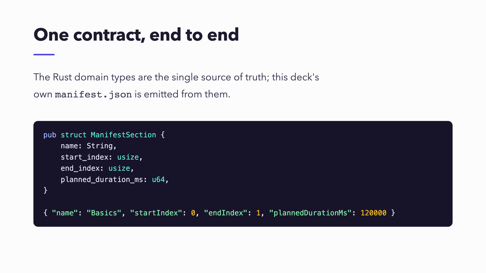
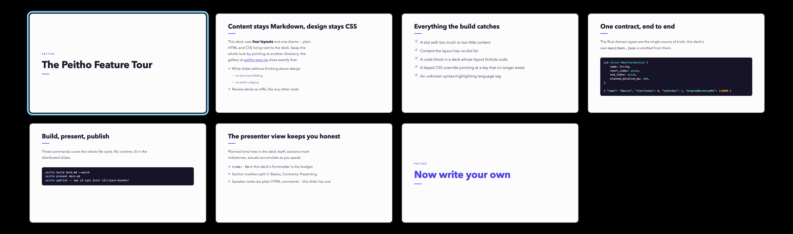
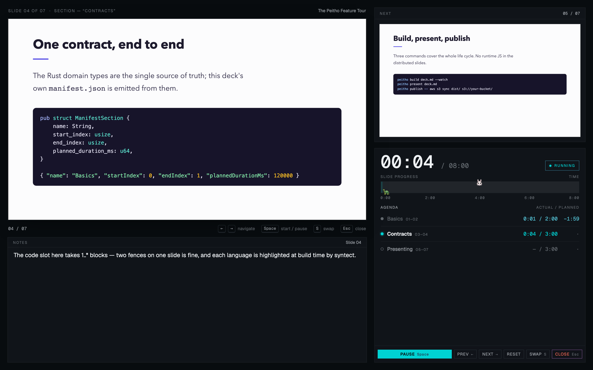

<!-- {"key":"cover","section":"Intro","time":"3m"} -->
# A Peitho Tour

<!-- A hands-on tour of Peitho — a Markdown-first presentation tool that takes you from installing the CLI all the way to publishing a finished deck. -->

---

<!-- {"key":"concept"} -->
# The concept

- **One tool, from writing to shipping** — authoring, preview, presenting, PDF export, and publishing all through `peitho`. No mid-flow tool switch.
- **Content owns the pen; design is delegated to AI** — you focus on Markdown; design is plain HTML and CSS that an LLM can generate and a human can steer through git diffs and reviews.

<!-- This deck's theme CSS itself was rewritten by an AI in a single "make it cooler" pass. -->

---

<!-- {"key":"pillars"} -->
# Three design pillars

- **Content and design stay separate** — content is Markdown; design is layout HTML plus theme CSS. Never mixed.
- **Design that fits in git** — layouts and themes are plain HTML and CSS files. They diff, they review.
- **Type-checked slot contracts** — when content does not match the layout, nothing is silently dropped: you get a build error with a line number.

<!-- The rest of this deck walks through how these three pillars play out during Write, Design, and Run. -->

---

<!-- {"key":"flow"} -->
# Write, preview, present

- **Write** — content goes in `deck.md` as Markdown. Design lives in layout HTML and theme CSS, and never leaks into the Markdown.
- **Preview** — `peitho preview` rebuilds and reloads the browser on every save.
- **Present** — `peitho present` places slides on the external display and the presenter view on the machine you drive.

<!-- These three loops are the whole of Peitho. The rest of the tour follows them in order. -->

---

<!-- {"key":"install","section":"Install","time":"1m"} -->
# Install

Peitho ships through Homebrew. Layouts, the base theme, and the presenter shell are all embedded in the binary, so there is no Node.js or other runtime to install. Any directory with a single `deck.md` is enough to work in.

```sh
brew install mizzy/tap/peitho
```

<!-- Prebuilt binaries for macOS arm64 and Linux x86_64 / arm64 are also on GitHub Releases. Shell completions install automatically through Homebrew. -->

---

<!-- {"key":"markdown","section":"Write","time":"6m"} -->
# A slide is just Markdown

Split slides on `---`. The shallowest heading becomes the title, fenced code blocks become code, and everything else becomes body content — each dropped into its own slot. The slots themselves are declared by the layout HTML, which we come back to in Design.

```markdown
# First slide

A body paragraph.

- Lists work too

---

# Second slide
```

---

<!-- {"key":"frontmatter"} -->
# Frontmatter configures the whole deck

The YAML at the top of the deck accepts seven keys: `time`, `aspect_ratio`, `resolution`, `layouts`, `css`, `syntaxes`, and `fonts`. Anything you omit falls back to a deck-adjacent directory of the same name, then to a built-in default. Missing paths and unknown keys are line-numbered build errors.

```yaml
---
time: 20m            # planned talk time
aspect_ratio: 16:9   # 16:9 or 4:3
layouts: ./layouts   # layout HTML (file or directory)
css: ./css           # theme CSS (file or directory)
syntaxes: ./syntaxes # extra sublime-syntax definitions
fonts: ./fonts       # bundled webfonts
---
```

---

<!-- {"key":"page-settings"} -->
# Per-slide settings are a JSON comment

An `<!-- {...} -->` at the top of a slide is that slide's page settings. `layout` pins the layout by name, `key` gives the slide a stable handle for CSS, and `section` and `time` declare an agenda section.

```markdown
<!-- {"key":"arch-1","layout":"code-demo","section":"Deep dive","time":"5m"} -->
# Architecture
```

---

<!-- {"key":"notes"} -->
# Speaker notes are HTML comments

Any HTML comment that is not JSON becomes a speaker note on that slide. Multiple comments concatenate. Notes only ride on the presenter view — they never leak into the published `dist/`.

```markdown
# Closing slide

<!-- Pause here and take questions. -->
<!-- If the demo box is dead, switch to the recorded run. -->
```

<!-- This very slide uses that pattern for its own note. You will see the presenter view a few slides from now. -->

---

<!-- {"key":"images"} -->
# Image-first slides

Write a paragraph that contains only a single image and Peitho routes the slide to a layout with an `accepts="image"` slot. The image has to be a local path relative to the deck (`png`, `jpg`, `jpeg`, `gif`, `webp`). Remote URLs, absolute paths, and parent-directory escapes are build errors.

```markdown

```

---

<!-- {"key":"sections"} -->
# Sections and time budgets

When a page settings comment declares `section`, the slides from that point until the next declaration make up one agenda section, and `time` is that section's budget. If the totals do not add up to the frontmatter `time`, that is a line-numbered build error. During the talk, the presenter view lines the plan up against your actual times.

```markdown
---
time: 15m
---

<!-- {"section":"Setup","time":"3m"} -->
# Setup

---

<!-- {"section":"Deep dive","time":"12m"} -->
# The main thing
```

---

<!-- {"key":"layout-schema","section":"Design","time":"5m"} -->
# The layout itself is the schema

The unit of design is a layout — a plain HTML file. `<slot>` elements declare each slot's name, accepted type, and arity, and Peitho reads that as a contract at build time. Drop a `layouts/` directory next to the deck and it is picked up automatically.

```html
<section class="peitho-slide">
  <h1><slot name="title" accepts="inline" arity="1"></slot></h1>
  <slot name="body" accepts="blocks" arity="0..*"></slot>
  <slot name="code" accepts="code" arity="0..1"></slot>
</section>
```

---

<!-- {"key":"dispatch"} -->
# How a layout gets picked

- **An explicit pin wins** — page settings say `{"layout":"cover"}`. Unknown names become build errors with a list of candidates.
- **If there is only one, it is always used** — contract violations still surface as errors the normal way.
- **Otherwise, type-driven dispatch** — Peitho matches the slide's shape against each layout's slot contract. Exactly one match wins; zero matches or multiple matches are build errors.

<!-- This deck is a four-layout setup, and every slide is routed purely by type-driven dispatch — no explicit `layout` pin anywhere. -->

---

<!-- {"key":"contract-error"} -->
# When it does not match, the build stops

Missing or extra slots, a type mismatch, CSS aimed at a key that does not exist, section times that do not sum to the deck's plan — all become build errors with line numbers and hints. Nothing gets silently dropped.

```
error: slide 2 ('code-slide'), line 7: slot 'code' got 2 item(s),
       but layout 'title-body-code' allows 0..1
  = help: use a layout with more code capacity or remove one code block
```

---

<!-- {"key":"keyed-css"} -->
# Target one slide by key

A slide with a `key` gets a `data-slide-key` attribute in the HTML, so CSS can style exactly that slide. Retitling the slide does not break the CSS, and any selector that targets a key not present in the deck is caught as a build error.

```markdown
<!-- {"key":"arch-1"} -->
# Architecture
```

::: {slot=code-2}
```css
[data-slide-key="arch-1"] .slot-code {
  grid-column: 2 / 3;
  width: 60%;
}
```
:::

---

<!-- {"key":"preview","section":"Run","time":"5m"} -->
# The edit loop lives in peitho preview

Preview watches the deck, its layouts, and its CSS. Every save triggers a rebuild and a browser reload. The currently visible slide and the overview state survive the reload, so the slide you were tweaking does not disappear on you.



---

<!-- {"key":"overview"} -->
# Press o for the overview

`o`, Enter, and Esc flip between single-slide and tile view. In the tile view, arrow keys walk the grid; click or Enter opens that slide. It doubles as a big-picture check and as a jump-to-slide shortcut.



---

<!-- {"key":"present"} -->
# peitho present takes the stage

Present places slides fullscreen on the external display and drops the presenter view on the machine you drive. Current slide, next slide, speaker notes, timer, and per-section plan-vs-actuals all live on one screen. Space starts the timer, Esc closes everything.



---

<!-- {"key":"remote"} -->
# Drive the deck from your phone

`peitho present --host` exposes `/remote` on your LAN (VPN like Tailscale is preferred), prints a terminal QR code, and pins the port to `6173` so the URL stays stable across runs. Scan it once in Safari, tap Add to Home Screen, and the remote opens chrome-free the next time you present.

```sh
peitho present --host
```

<!-- The bare form auto-picks the best non-loopback address; pass `--host 100.64.0.5` (or `0.0.0.0`) to bind a specific one. `--port` overrides the fixed default when 6173 is taken. -->

---

<!-- {"key":"ship"} -->
# Export to PDF, publish anywhere

PDF export is a single command. Publishing runs `peitho publish` to gate on `dist/`, then hands off to whatever deploy command you already have on the far side of `--`. Peitho does not reinvent deployment.

```sh
peitho export pdf -o deck.pdf
peitho publish -- aws s3 sync dist/ s3://your-bucket/
```

<!-- This deck itself is built by CI and served that way. Because builds are deterministic, the contract check in CI doubles as a review gate. -->

---

<!-- {"key":"closing","section":"Close","time":"1m"} -->
# Start with one slide, in Markdown

<!-- brew install, write a deck.md, run peitho preview — that is the whole starting move. Samples live at peitho.gosu.ke; the README on GitHub has the rest. -->
