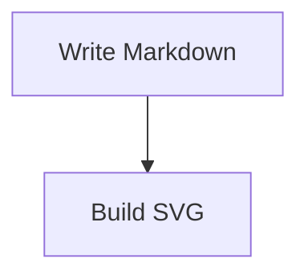

+++
title = "Frontmatter"
weight = 40
template = "guide-page.html"
description = "Use deck frontmatter for time, canvas, PDF, layout, CSS, syntax, font, and code image settings."
+++

## Frontmatter belongs at the top

Deck-level settings live in YAML frontmatter at the top of the deck. The body
is restricted to flat `key:` lines, plus one nested `code_images:` mapping
level, with trailing stylistic blank lines allowed. Settings anywhere but the
top are not accepted as deck settings.

Invalid or misplaced settings are line-numbered build errors with help. A
leading `---` without valid frontmatter, malformed YAML, and Markdown swallowed
by a missing closing `---` all stop the build.

## Keys

Supported keys are `time`, `aspect_ratio`, `resolution`, `layouts`, `css`,
`syntaxes`, `fonts`, and `code_images`.

| Key | Purpose |
| --- | --- |
| `time` | Planned presentation time: `15m`, `90s`, `1h30m`, or a bare integer in minutes. |
| `aspect_ratio` | Slide canvas aspect ratio: `16:9` (default) or `4:3`. |
| `resolution` | PDF-only physical page size in `WxH` CSS pixels. |
| `layouts` | Layout HTML file or directory. |
| `css` | Theme CSS file or directory. |
| `syntaxes` | Custom syntect syntax file or directory. |
| `fonts` | Font asset file or directory. |
| `code_images` | Commands that turn matching fenced code blocks into SVG images. |

Examples in the repository include:

```yaml
time: 8m
```

```yaml
aspect_ratio: 16:9
resolution: 1920x1080
```

## Code images

Use `code_images` when a fenced code block should be rendered by an external
command at build time and then treated as an image. Each entry maps a language
tag to a command string. Peitho shell-splits the string into argv and executes
the program directly; it does not run the command through `sh -c`.

````markdown
---
code_images:
  mermaid: mmdc -i - -o - -e svg
---

# Flow


````

The command receives the code block text on stdin and must write an SVG document
to stdout. The generated SVG is cached under `.peitho/code-images-cache/` and
then flows through the normal image resolver, so layouts should provide an
`accepts="image"` slot.

Preview watches the deck, layout, CSS, syntax, and font roots. It does not watch
files read by the command itself, such as Mermaid theme files or config JSON.
Restart preview or touch the deck after changing those command inputs.

## Asset resolution order

For asset keys, Peitho resolves assets in this order:

1. Explicit frontmatter path.
2. Deck-adjacent auto-detect: `layouts/`, `css/`, `syntaxes/`, or `fonts/`
   next to the deck.
3. Built-in defaults for layouts, CSS, and syntaxes; no extra asset for fonts.

An explicit path that does not exist is a line-numbered build error, not a
silent fallback to auto-detect or built-ins.

## File and directory behavior

Each asset key may point at a file or a directory. Directories are read in
deterministic filename order.

Layouts read `*.html`. CSS reads `*.css`. Syntaxes read
`*.sublime-syntax` and augment the built-in syntax set. Fonts copy files
verbatim without an extension filter, so `.woff2`, `.ttf`, and `@font-face` CSS
files can live side by side.

## Error behavior

Unknown keys, bad values, missing explicit paths, invalid `time`, and malformed
frontmatter stop the build with line-numbered errors and help. Time validation
requires nonzero values, rejects overflow, and keeps values within JavaScript's
safe integer range before they reach the manifest.
