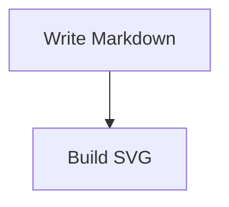

+++
title = "Frontmatter"
weight = 40
template = "guide-page.html"
description = "Use deck frontmatter for time, canvas, PDF, layout, CSS, syntax, font, and code image settings."
+++

## Frontmatter belongs at the top

Deck-level settings live in YAML frontmatter at the top of the deck. The body
is restricted to flat `key:` lines, plus one nested `code_images:` mapping
level, with trailing stylistic blank lines allowed. Settings anywhere but the
top are not accepted as deck settings.

Invalid or misplaced settings are line-numbered build errors with help. A
leading `---` without valid frontmatter, malformed YAML, and Markdown swallowed
by a missing closing `---` all stop the build.

## Keys

Supported keys are `time`, `aspect_ratio`, `resolution`, `breaks`,
`page_numbers`, `pointer_color`, `lang`, `layouts`, `css`, `syntaxes`, `fonts`,
and `code_images`.

| Key | Purpose |
| --- | --- |
| `time` | Planned presentation time: `15m`, `90s`, `1h30m`, or a bare integer in minutes. |
| `aspect_ratio` | Slide canvas aspect ratio: `16:9` (default) or `4:3`. |
| `resolution` | PDF-only physical page size in `WxH` CSS pixels. |
| `breaks` | Render single newlines in slide body Markdown as hard line breaks: `true` or `false` (default). |
| `page_numbers` | Show a page number on every slide: `current` or `current_of_total`. Omitted means no page numbers. |
| `pointer_color` | Color of the laser pointer overlay driven from the phone remote: `#RGB`, `#RRGGBB`, `#RGBA`, `#RRGGBBAA`, or a CSS named color. |
| `lang` | Deck language as a BCP 47 tag, emitted as `<html lang>` on every page that renders slides: `en` (default), `ja`, `zh-Hans`, … Language-sensitive CSS such as `word-break: auto-phrase` keys off this. |
| `layouts` | Layout HTML file or directory. |
| `css` | Theme CSS file or directory. |
| `syntaxes` | Custom syntect syntax file or directory. |
| `fonts` | Font asset file or directory. |
| `code_images` | External commands or overrides that turn matching fenced code blocks into SVG images. |

Examples in the repository include:

```yaml
time: 8m
```

```yaml
aspect_ratio: 16:9
resolution: 1920x1080
```

## Page numbers

`page_numbers` turns on a page number for the whole deck. `current` renders the
slide's own number; `current_of_total` renders it against the deck total:

```yaml
page_numbers: current_of_total
```

Individual slides opt out in their page settings comment with
`"page_number":false` — useful for a cover or a closing slide:

```markdown
<!-- {"page_number":false} -->

# Title slide
```

Only `false` is accepted there; `"page_number":true` is a build error, because
the deck-level key is what turns numbering on. Using `"page_number":false`
without a deck-level `page_numbers` is also a line-numbered error rather than a
silent no-op.

## Remote pointer color

`pointer_color` sets the color of the laser pointer overlay driven from the
phone remote:

```yaml
pointer_color: "#38bdf8"
```

Accepted values are `#RGB`, `#RRGGBB`, `#RGBA`, `#RRGGBBAA`, and CSS named
colors such as `cyan`. See [CLI](@/guide/cli.md) for turning the pointer on
during a talk.

## Code images

Fenced `math` blocks are rendered by Peitho's built-in KaTeX renderer into
HTML+MathML body content. They need no frontmatter. When a deck uses math,
Peitho prepends KaTeX CSS to `peitho.css` and writes fonts under
`katex-fonts/`.

Fenced `mermaid` blocks are rendered by Peitho's built-in Mermaid renderer and
then treated as images. An `embed` block containing one X status URL defaults
to a cached PNG screenshot. A fence option selects X card mode:

````markdown
```embed mode=card
https://x.com/gosukenator/status/2074821309259973046
```
````

Card mode fetches raw oEmbed JSON with system `curl` on a cache miss, regenerates
escaped HTML on every build, and never invokes Chrome. Cards are body content
for `accepts="blocks"` slots; default or explicit `mode=screenshot` embeds are
images for `accepts="image"` slots.

A bare non-X HTTP(S) URL instead uses generic oEmbed discovery:

````markdown
```embed
https://www.youtube.com/watch?v=dQw4w9WgXcQ
```
````

Generic embeds are always static body cards for `accepts="blocks"` slots. If
oEmbed supplies a thumbnail, Peitho downloads and validates it at build time,
then publishes it through the normal hashed-image pipeline; otherwise the card
contains the available title, author, and provider text. Provider HTML is never
injected, and `mode=` is rejected because its values are X-only.

Generic discovery page, JSON endpoint, and thumbnail fetches use bounded
system `curl` requests with HTTP(S)-only redirects. The discovery page is not
cached. Raw JSON and validated image bytes are cached separately under
`.peitho/embeds-cache/`, so complete hits need neither curl nor Chrome; errors
name the exact files to delete to refresh metadata or the complete card.

Use `code_images` for other diagram tags, or when a deck needs to override the
built-in Mermaid, math, or embed renderer with an external command.

Each `code_images` entry maps a language tag to a command string. Peitho
shell-splits the string into argv and executes the program directly; it does
not run the command through `sh -c`.

````markdown
---
code_images:
  dot: dot -Tsvg
  mermaid: mmdc -i - -o - -e svg  # optional override
  math: latex-to-svg              # optional override
  embed: tweet-to-svg             # optional override; receives the full body
---

# Flow


```mermaid
graph TD
  A[Write Markdown] --> B[Build SVG]
```
````

The command receives the code block text on stdin and must write an SVG document
to stdout. The generated SVG is cached under `.peitho/code-images-cache/` and
then flows through the normal image resolver, so layouts should provide an
`accepts="image"` slot. This also applies to `code_images.math` overrides; the
built-in math renderer is the body-inline HTML path. An explicit
`code_images.embed` override also uses the external SVG/image path. It rejects
`mode=` fence options; with a bare `embed` fence it receives the entire body
verbatim on stdin.

Bare boolean values such as `mermaid: false` and `math: true` are reserved for
possible future built-in opt-out syntax and are rejected with a line-numbered
error. Use a command string when you want an override.

Preview watches the deck, layout, CSS, syntax, and font roots. It does not watch
files read by the command itself, such as Mermaid theme files or config JSON.
Restart preview or touch the deck after changing those command inputs.

See [Code Images](@/examples/code-images.md) for a complete built-in Mermaid
and Graphviz example deck, [Math](@/examples/math.md) for built-in math, and
[Tweet Embed](@/examples/tweet-embed.md) for X and generic embeds.

## Asset resolution order

For asset keys, Peitho resolves assets in this order:

1. Explicit frontmatter path.
2. Deck-adjacent auto-detect: `layouts/`, `css/`, `syntaxes/`, or `fonts/`
   next to the deck.
3. Built-in defaults for layouts, CSS, and syntaxes; no extra asset for fonts.

An explicit path that does not exist is a line-numbered build error, not a
silent fallback to auto-detect or built-ins.

## File and directory behavior

Each asset key may point at a file or a directory. Directories are read in
deterministic filename order.

Layouts read `*.html`. CSS reads `*.css`. Syntaxes read
`*.sublime-syntax` and augment the built-in syntax set. Fonts copy files
verbatim without an extension filter, so `.woff2`, `.ttf`, and `@font-face` CSS
files can live side by side.

## Error behavior

Unknown keys, bad values, missing explicit paths, invalid `time`, and malformed
frontmatter stop the build with line-numbered errors and help. Time validation
requires nonzero values, rejects overflow, and keeps values within JavaScript's
safe integer range before they reach the manifest.
